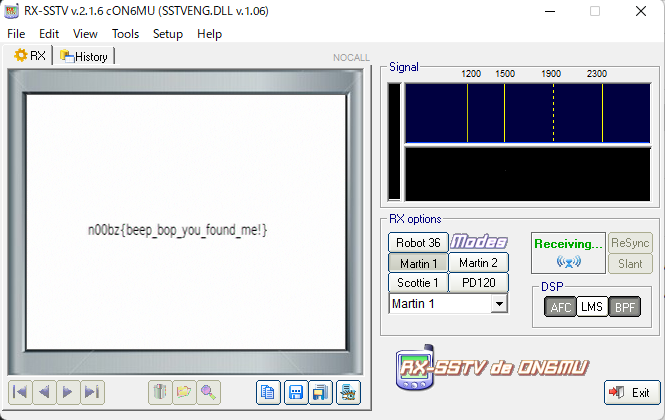

# BeepBop

## 問題文
> The noises, Mason! What do they mean?
> - Note: Flag is all lowercase, there are no numbers! 
    Author: NoobMaster

## 解法
SSTV音声のため，ソフトを使って解析

RS-SSTVを起動させたのち，音声ファイルを流せば以下の画像が出てくる

## flag

> n00bz{beep_bop_you_found_me!}